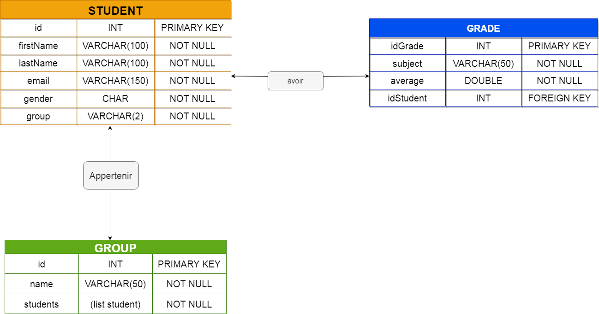

# SpringProject

## Presentation

This repository is the final project in PROG2 and DONNEE2 whose theme is \'note des etudiant\'

#### This project used :
    - Spring Boot
    - PostgreSQL in DataBase 
    - Thymeleaf in View or Front-End
And for load this project, change value in file application.properties
## API
Link :    [Swagger OpenAPI ](https://petstore.swagger.io/?url=https://raw.githubusercontent.com/Daris02/SpringProject/main/openAPI.yml#/)

## Database Schema

